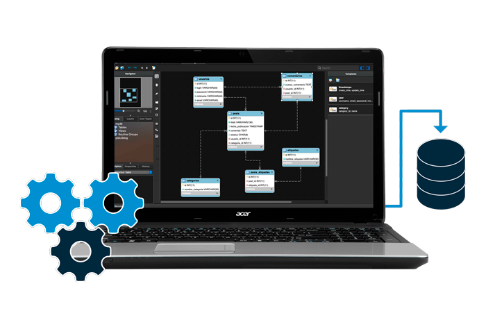
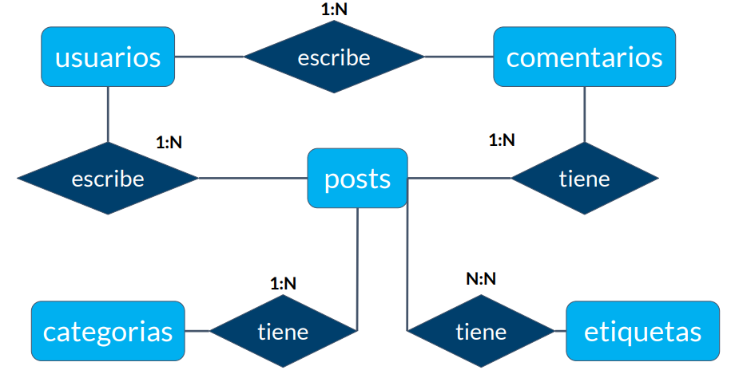
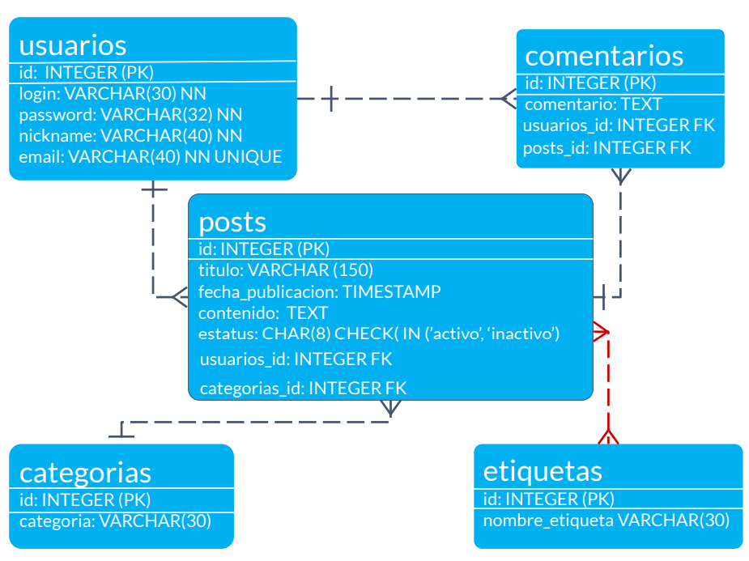
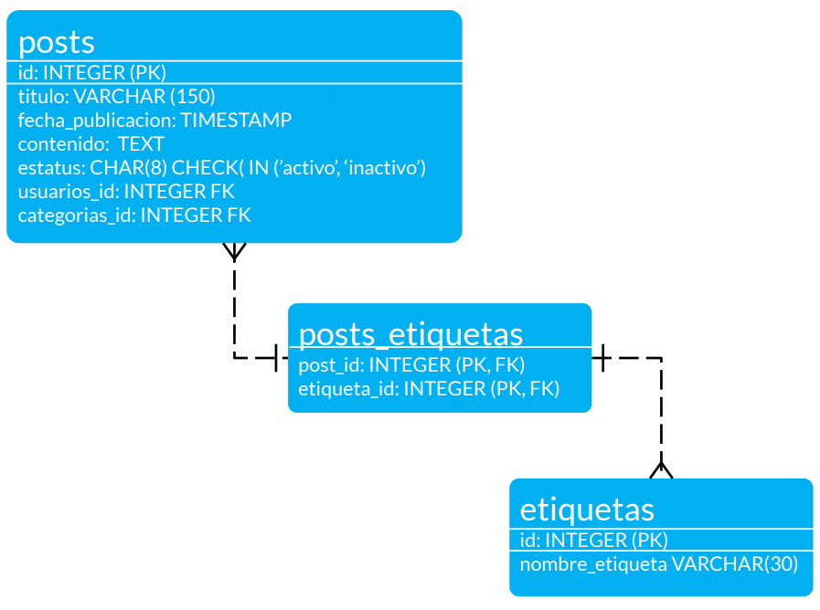
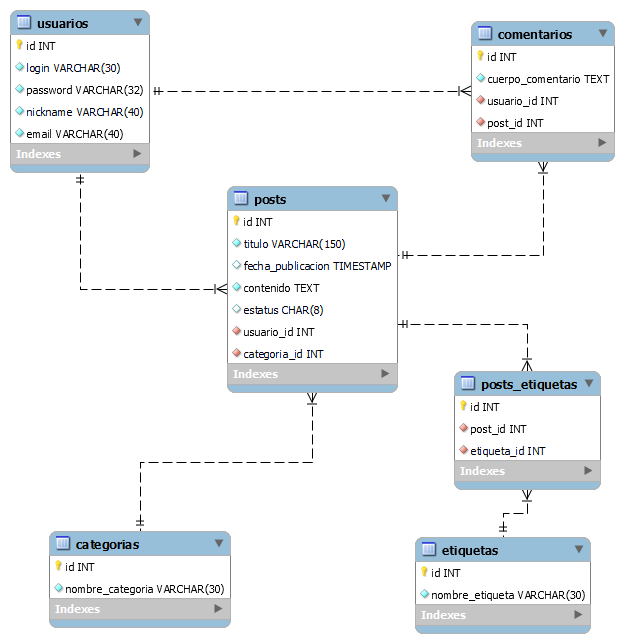

# Sistema de Blogs

Diseño de una base de datos para un sistema de blogs



## **Entidades del Proyecto**

- **`Posts`**

  - Id
  - Titulo
  - Fecha de publicación
  - Contenido
  - Estatus

- **`Usuarios`**

  - Id
  - Login
  - Password
  - Email
  - Nickname

- **`Comentarios`**

  - id
  - Contenido

- **`Categorías`**

  - Id
  - Nombre

- **`Etiquetas`**
  - Id
  - Nombre

## **Diagrama Entidad Relación (ER)**



### **Normalización**



Como `posts` y `etiquetas` tienen una relación N:N, construimos la tabla intermedia `posts_etiquetas`



## **Creando el Blog**

### **Tablas independientes**

```sql
/* CREAR BASE DE DATOS */
CREATE SCHEMA `blog`;

/* CREAR TABLA "CATEGORIAS" */
CREATE TABLE `blog`.`categorias` (
  `id` int NOT NULL AUTO_INCREMENT,
  `nombre_categoria` varchar(30) NOT NULL,
  PRIMARY KEY (`id`)
);

/* CREAR TABLA "ETIQUETAS" */
CREATE TABLE `blog`.`etiquetas` (
  `id` INT NOT NULL AUTO_INCREMENT,
  `nombre_etiqueta` VARCHAR(30) NOT NULL,
  PRIMARY KEY ('id')
);

/* CREAR TABLA "USUARIOS" */
CREATE TABLE `blog`.`usuarios` (
  `id` INT NOT NULL AUTO_INCREMENT,
  `login` VARCHAR(30) NOT NULL,
  `password` VARCHAR(32) NOT NULL,
  `nickname` VARCHAR(40) NOT NULL,
  `email` VARCHAR(40) NOT NULL,
  PRIMARY KEY (`id`),
  UNIQUE INDEX `email_UNIQUE` (`email` ASC) VISIBLE
);
```

### **Tablas dependientes**

Hay que tener en cuenta la dependencia de las tablas a la hora de elegir el **orden** para crearlas. No se puede crear una tabla que tenga la llave foránea de una tabla que no se creo todavía.

**NOTA:** No se crea la columna estatus con el `check` ya que a pesar de ser una herramienta muy útil no es estándar en todos los manejadores.

```sql
/* CREAR TABLA "POSTS" */
CREATE TABLE `blog`.`posts` (
  `id` INT NOT NULL AUTO_INCREMENT,
  `titulo` VARCHAR(150) NOT NULL,
  `fecha_publicacion` TIMESTAMP NULL,
  `contenido` TEXT NOT NULL,
  `estatus` CHAR(8) NULL DEFAULT 'activo',
  `usuario_id` INT NOT NULL,
  `categoria_id` INT NOT NULL,
  PRIMARY KEY (`id`)
);

/* AGREGAR LLAVE FORANEA DE LA TABLA "USUARIOS" A LA TABLA "POSTS" */
ALTER TABLE `blog`.`posts`
ADD INDEX `posts_usuarios_idx` (`usuario_id` ASC) VISIBLE;
;
ALTER TABLE `blog`.`posts`
ADD CONSTRAINT `posts_usuarios`
  FOREIGN KEY (`usuario_id`)
  REFERENCES `blog`.`usuarios` (`id`)
  ON DELETE NO ACTION
  ON UPDATE CASCADE;

/* AGREGAR LLAVE FORANEA DE LA TABLA "CATEGORIAS" A LA TABLA "POSTS" */
ALTER TABLE `blog`.`posts`
ADD INDEX `posts_categorias_idx` (`categoria_id` ASC) VISIBLE;
;
ALTER TABLE `blog`.`posts`
ADD CONSTRAINT `posts_categorias`
  FOREIGN KEY (`categoria_id`)
  REFERENCES `blog`.`categorias` (`id`)
  ON DELETE NO ACTION
  ON UPDATE NO ACTION;

/* CREAR TABLA "COMENTARIOS" */
CREATE TABLE `blog`.`comentarios` (
  `id` INT NOT NULL AUTO_INCREMENT,
  `cuerpo_comentario` TEXT NOT NULL,
  `usuario_id` INT NOT NULL,
  `post_id` INT NOT NULL,
  PRIMARY KEY (`id`));

/* AGREGAR LLAVE FORANEA DE LA TABLA "USUARIOS" A LA TABLA "COMENTARIOS" */
ALTER TABLE `blog`.`comentarios`
ADD INDEX `comentarios_usuarios_idx` (`usuario_id` ASC);
;
ALTER TABLE `blog`.`comentarios`
ADD CONSTRAINT `comentarios_usuarios`
  FOREIGN KEY (`usuario_id`)
  REFERENCES `blog`.`usuarios` (`id`)
  ON DELETE NO ACTION
  ON UPDATE NO ACTION;

/* AGREGAR LLAVE FORANEA DE LA TABLA "POSTS" A LA TABLA "COMENTARIOS" */
ALTER TABLE `blog`.`comentarios`
ADD INDEX `comentarios_posts_idx` (`post_id` ASC);
;
ALTER TABLE `blog`.`comentarios`
ADD CONSTRAINT `comentarios_posts`
  FOREIGN KEY (`post_id`)
  REFERENCES `blog`.`posts` (`id`)
  ON DELETE NO ACTION
  ON UPDATE NO ACTION;
```

### **Tablas transitivas**

Las tablas transitivas sirven como **puente** para unir dos tablas. No tienen contenido semántico.

```sql
/* CREAR TABLA TRANSITIVA POSTS-ETIQUETAS */
CREATE TABLE `blog`.`posts_etiquetas` (
  `id` INT NOT NULL AUTO_INCREMENT,
  `post_id` INT NOT NULL,
  `etiqueta_id` INT NOT NULL,
  PRIMARY KEY (`id`));

/* AGREGAR LLAVE FORANEA DE LA TABLA "POSTS" A LA TABLA TRANSITIVA */
ALTER TABLE `blog`.`posts_etiquetas`
ADD INDEX `postsetiquetas_post_idx` (`post_id` ASC);
;
ALTER TABLE `blog`.`posts_etiquetas`
ADD CONSTRAINT `postsetiquetas_post`
  FOREIGN KEY (`post_id`)
  REFERENCES `blog`.`posts` (`id`)
  ON DELETE NO ACTION
  ON UPDATE NO ACTION;

/* AGREGAR LLAVE FORANEA DE LA TABLA "ETIQUETAS" A LA TABLA TRANSITIVA */
ALTER TABLE `blog`.`posts_etiquetas`
ADD INDEX `postsetiquetas_etiquetas_idx` (`etiqueta_id` ASC);
;
ALTER TABLE `blog`.`posts_etiquetas`
ADD CONSTRAINT `postsetiquetas_etiquetas`
  FOREIGN KEY (`etiqueta_id`)
  REFERENCES `blog`.`etiquetas` (`id`)
  ON DELETE NO ACTION
  ON UPDATE NO ACTION;
```

### **Schema**

Schema generado con `mysqldump`

[schema.sql](schema.sql)

### **Reverse Engineer del proyecto**

Con **MySQL Workbench** la opción de **Reverse Engineer** nos reproduce el esquema del cual nos basamos para crear nuestras tablas.



## **Introducimos datos de prueba**

- [Usuarios](inserts/insert_users.sql)
- [Categorías](inserts/insert_categories.sql)
- [Etiquetas](inserts/insert_tags.sql)
- [Posts](inserts/insert_posts.sql)
- [Posts-Etiquetas](inserts/insert_poststags.sql)

## **Consultas a la base de datos**

### ¿Que usuario ha contribuido con mas post?

```sql
SELECT u.nickname, COUNT(*) cant_posts
FROM usuarios AS u
	INNER JOIN posts as p ON u.id = p.usuario_id
GROUP BY u.id
ORDER BY cant_posts DESC;
```

| nickname | cant_posts |
| -------- | ---------- |
| Moni     | 9          |
| Israel   | 6          |
| Ed       | 4          |
| Lau      | 2          |

### ¿De que categorías escribe cada usuario?

```sql
SELECT u.nickname, COUNT(*) as cant_posts, GROUP_CONCAT( DISTINCT nombre_categoria) as categorias
FROM usuarios AS u
	INNER JOIN posts as p ON u.id = p.usuario_id
    INNER JOIN categorias as c ON c.id = p.categoria_id
GROUP BY u.id
ORDER BY cant_posts DESC;
```

| nickname | cant_posts | categorias                           |
| -------- | ---------- | ------------------------------------ |
| Moni     | 9          | Ciencia,Deportes,Economía,Tecnología |
| Israel   | 6          | Deportes,Economía,Tecnología         |
| Ed       | 4          | Espectáculos                         |
| Lau      | 2          | Ciencia                              |

### ¿Cuántos posts hay por categoria?

```sql
SELECT c.nombre_categoria, COUNT(*) as cant_posts
from categorias AS c
	INNER JOIN posts as p ON c.id = p.categoria_id
GROUP BY c.id
ORDER BY cant_posts DESC;
```

| nombre_categoria | cant_posts |
| ---------------- | ---------- |
| Tecnología       | 5          |
| Deportes         | 5          |
| Ciencia          | 4          |
| Espectáculos     | 4          |
| Economía         | 3          |

### ¿Cuáles y cuantas etiquetas hay en cada post?

```sql
SELECT posts.titulo, GROUP_CONCAT(nombre_etiqueta) as etiquetas, COUNT(*)num_etiquetas
FROM posts
	INNER JOIN posts_etiquetas ON posts.id = posts_etiquetas.post_id
    INNER JOIN etiquetas ON etiquetas.id = posts_etiquetas.etiqueta_id
GROUP BY posts.id
ORDER BY num_etiquetas DESC;
```

| titulo                                                        | etiquetas                                           | num_etiquetas |
| ------------------------------------------------------------- | --------------------------------------------------- | ------------- |
| Los mejores vestidos en la alfombra roja                      | Celebridades,Eventos,Moda,Estilo                    | 4             |
| Se mejora la conducción autónoma de vehículos                 | Robótica,Computación,Automovilismo,Avances          | 4             |
| La bolsa cae estrepitosamente                                 | Bolsa de valores,Inversiones,Brokers,Largo plazo    | 4             |
| Bienes raices más baratos que nunca                           | Inversiones,Largo plazo,Bienes Raíces,Bienes Raíces | 4             |
| Se descubre nueva partícula del modelo estandar               | Avances,Nobel,Física                                | 3             |
| Químicos descubren nanomaterial                               | Avances,Nobel,Química                               | 3             |
| Equipo veterano da un gran espectaculo                        | Campeonatos,Equipos,Celebridades                    | 3             |
| Fuccia OS sacude al mundo                                     | Computación,Teléfonos Móviles,Avances               | 3             |
| Escándalo en el mundo de la moda                              | Celebridades,Moda,Estilo                            | 3             |
| Se descubre la unión entre astrofísica y fisica cuántica      | Avances,Nobel,Física                                | 3             |
| Se presenta el nuevo teléfono móvil en evento                 | Teléfonos Móviles,Eventos                           | 2             |
| Tenemos un nuevo auto inteligente                             | Computación,Automovilismo                           | 2             |
| Ganador del premio Nobel por trabajo en genética              | Nobel,Avances                                       | 2             |
| Se fortalece el peso frente al dolar                          | Bolsa de valores,Inversiones                        | 2             |
| Tenemos ganador de la formula e                               | Automovilismo,Campeonatos                           | 2             |
| Ganan partido frente a visitantes                             | Campeonatos,Equipos                                 | 2             |
| U.S. Robotics presenta hallazgo                               | Robótica,Avances                                    | 2             |
| Cierra campeonato mundial de football de manera impresionante | Campeonatos,Equipos                                 | 2             |
| Tenemos campeona del mundial de volleiball                    | Campeonatos,Celebridades                            | 2             |
| Los paparatzi captan escándalo en cámara                      | Celebridades                                        | 1             |
| Escándalo con el boxeador del momento                         | Celebridades                                        | 1             |
